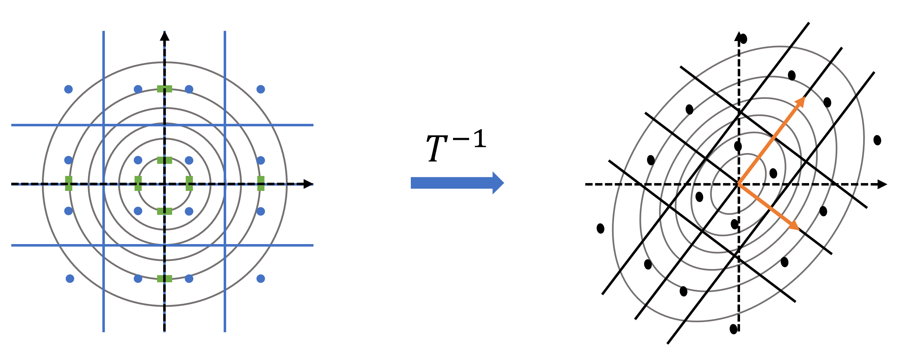
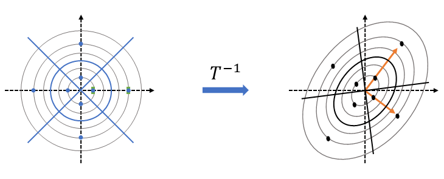
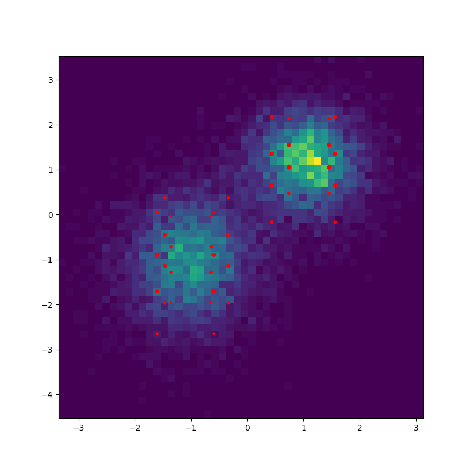
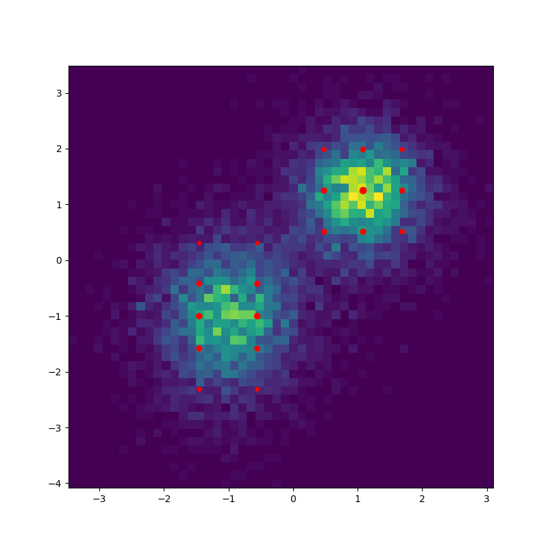

# Discretize Distributions
PyTorch based package for discretizing multivariate Gaussian and Gaussian mixture distributions with **guarantees in 2-Wasserstein distance**, designed for downstream tasks in uncertainty quantification, control, and learning. All components are fully vectorized and batch-friendly.

The discretization procedure was first proposed in [Adams et al. (2024)](https://arxiv.org/pdf/2407.18707), and 
subsequently applied in [Figueiredo et al. (2025a)](https://arxiv.org/pdf/2506.08689) and [Adams et al. (2025b)](https://arxiv.org/pdf/2505.11219).

## Installation
You can install the package directly from this repository:

```bash
pip install git+https://github.com/sjladams/discretize_distributions
```
*(A PyPI release will follow soon.)*

## Quick start

```python
    import torch
    import discretize_distributions as dd

    # Mixture of 3 Gaussians in 2D
    locs = torch.tensor([[0., 0.], [1., 1.], [2., 0.]])
    covs = torch.eye(2).expand(3, 2, 2)
    weights = torch.tensor([0.3, 0.4, 0.3])

    components = dd.distributions.MultivariateNormal(loc=locs, covariance_matrix=covs)
    mix = dd.distributions.Categorical(probs=weights)
    gmm = dd.distributions.MixtureMultivariateNormal(mix, components)

    # Discretize into 20 support points. With per_mode=True, a grid is constructed around each mode,
    # and each component is discretized using the grid corresponding to the mode to which it contributes most.
    scheme = dd.generate_scheme(gmm, configuration="grid", per_mode=True, scheme_size=20)
    disc_gmm, w2 = dd.discretize(gmm, scheme)

    print(f"W2 Error: {w2:.2f}, Support size: {disc_gmm.num_components})")
```

For more examples (grid vs. cross schemes, degenerate mixtures, batched discretization, uncertainty propagation application, and plotting utilities), see the [`examples/`](./examples) folder.

## Method Overview
<figure>
  <div style="display: flex; justify-content: center; gap: 16px; align-items: flex-start;">
    <div style="text-align: center;">
      
      <div><b>(a)</b> Grid scheme.</div>
    </div>
    <div style="text-align: center;">
      
      <div><b>(b)</b> Cross scheme.</div>
    </div>
  </div>

  <p style="text-align: center; margin-top: 8px;">
    <b>Figure 1:</b> Discretization of a 2D Gaussian distribution (black dots) using a standard Gaussian (blue dots) as a template for grid and cross configurations.
    In the eigenbasis T of the covariance matrix (orange arrows), the Gaussian’s dimensions are independent, allowing efficient construction of the discrete support.
    In <b>(a)</b>, the support is obtained by taking the cross-product of one-dimensional signatures of each univariate marginal, while in <b>(b)</b> symmetric points are placed along each principal axis (green markers).
    The final signature in the original space follows by mapping these points through T<sup>-1</sup>. Blue and black lines indicate the Voronoi partitions in the transformed and original spaces, respectively.
  </p>
</figure>

Given a continuous distribution $p$ and a set of points $\mathcal{C} = \{x_i\}_{i=1}^N$, we aim to construct a discrete distribution of the form  
$$
    d_{\mathcal{C}} = \sum_{i=1}^N w_i \,\delta_{x_i},
$$
where each weight $w_i$ corresponds to the probability mass of $p$ over the **Voronoi cell** associated with $x_i$, induced by the set $\mathcal{C}$. The **2-Wasserstein error** between $p$ and $d_{\mathcal{C}}$ can be computed from the first and second moments of $p$ conditioned on these Voronoi cells. Exact computation of the weights and the Wasserstein error is feasible when the geometry of the scheme, and thus its Voronoi partition, **aligns with the geometry of the underlying distribution**. This alignment holds, for example, when $p$ is Gaussian and $\mathcal{C}$ forms either a **grid of points** or a **uniform cross of points** aligned with the eigenbasis of the covariance matrix. In these cases, the weights can be computed efficiently in closed form, as illustrated in Figure&nbsp;1, and the Wasserstein error can be evaluated in a similarly efficient manner.

The corresponding schemes, consisting of the support points and their Voronoi partitions, are constructed in `generate_scheme`. Grid templates are generated offline (see the [`lookup_generators/`](src/discretize_distributions/lookup_generators/) folder.) and stored in the [`data/`](src/discretize_distributions/data/) folder. The eigenbasis is computed through a robust eigenvalue decomposition implemented using the `xitorch` package, which allows for the treatment of **degenerate covariance matrices** (see [`degenerate_distributions.py`](examples/degenerate_distributions.py)). Based on the resulting eigenvalues, the algorithm determines an optimal grid layout, specifying how to allocate the total number of grid points across dimensions.  

This efficient construction of discrete approximations of Gaussian distributions and computation of the Wasserstein error forms the **core building block** of the package, enabling its extension to Gaussian mixture models (GMMs).

- **Component-wise discretization.**  
  The most direct approach applies the discretization procedure independently to each component in the Gaussian mixture. This method, presented in [Adams et al. (2024)](https://arxiv.org/pdf/2407.18707), is implemented through the `LayeredScheme` class in `schemes`, where the scheme for each component is represented as a separate layer.

- **Per-mode (shared-scheme) discretization.**  
  We extend the procedure to construct a shared discretization scheme for clusters of components that share a common local geometry (i.e., similar covariance eigenbases). These clusters are defined based on the **modes** of the GMM, which are identified via a gradient-based optimization procedure. Each cluster is then discretized using a scheme constructed from a local Gaussian approximation of the mixture around that mode.

A key feature of the package is the ability to **generate, orient, and combine different schemes** with distinct geometries. This functionality is enabled by the `Axes` and `AxesAlignedPoints` objects, which provide a unified representation of scheme orientations and transformations. An introduction to these classes and their operations is provided in [`intro_axes_points_schemes.py`](`examples/intro_axes_points_schemes.py`).

<figure>
  <div style="display: flex; justify-content: center; gap: 16px; align-items: flex-start;">
    <div style="text-align: center;">
      
      <div><b>(a)</b> Per-component (W2 Error: 0.45).</div>
    </div>
    <div style="text-align: center;">
      
      <div><b>(b)</b> Per-mode (W2 Error: 0.45).</div>
    </div>
  </div>
  <p style="text-align: center; margin-top: 8px;">
    <b>Figure 2:</b> Discretization of a 2D Gaussian mixture with four components sharing a commuting eigenbasis and two modes.  
    In <b>(a)</b>, each component is discretized individually using a grid scheme, and the resulting supports are combined.  
    In <b>(b)</b>, a single grid discretization is used for the components closest to each mode, based on a local Gaussian approximation around that mode.
  </p>
</figure>


## Citation

If you use this software in your research, please cite:

```bibtex
@misc{Adams2024,
    author={Steven Adams},
    title = {Discretize Distributions},
    year = {2024},
    publisher = {GitHub},
    journal = {GitHub repository},
    howpublished = {\url{https://github.com/sjladams/discretize_distributions}}
}
```

## Authors

- **Steven Adams** — PhD Candidate, Delft University of Technology (TU Delft)

## Funding and Support

- Delft University of Technology
